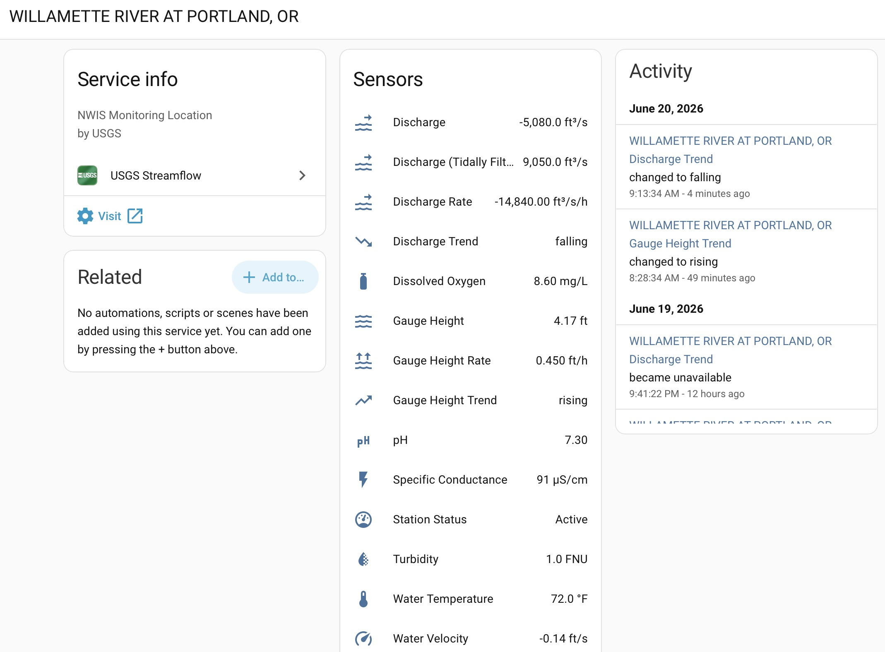
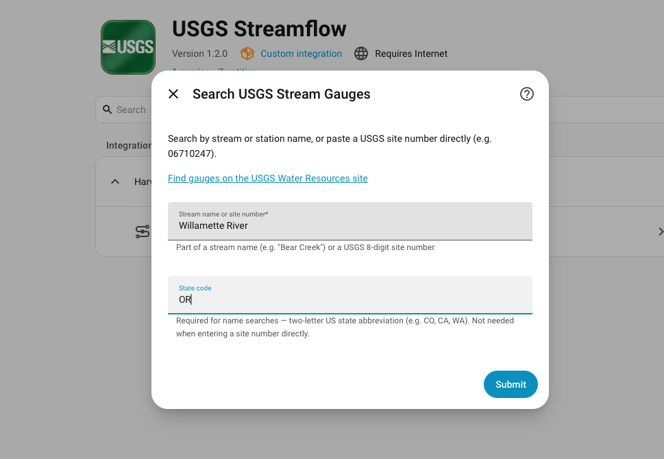
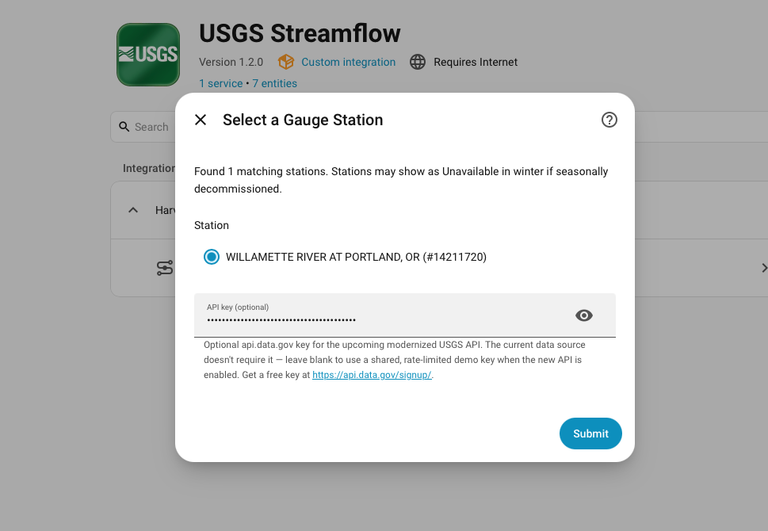
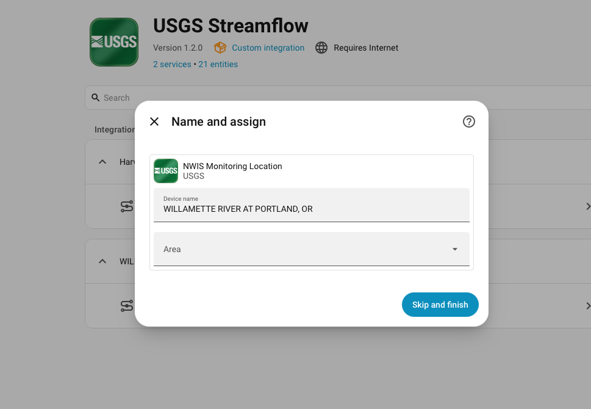
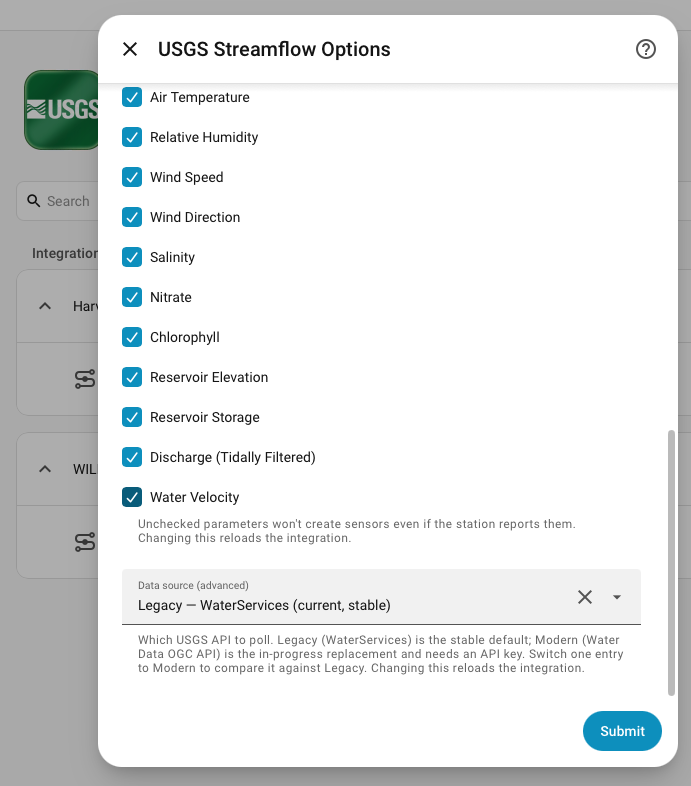

# USGS Streamflow for Home Assistant

Bring real-time U.S. water data into Home Assistant. This integration polls the
[USGS National Water Information System (NWIS)](https://waterdata.usgs.gov/) for
any active monitoring location in the United States — streams, lakes and
reservoirs, canals, tidal gages, groundwater wells, and continuous
water-quality sites — and exposes each reported measurement as a sensor, with
automatic handling of seasonal shutdowns and built-in rate-of-change/trend
sensors for level and flow.

No account or API key is required for the default data source. An optional
**Modern** backend (the new USGS Water Data OGC API) is available per site for
those who want to opt in early — see [Data sources](#data-sources).

  
   <em>One gauge → one device, with a sensor per reported parameter. Here the
  tidal Willamette River at Portland shows discharge, tidally-filtered discharge,
  gauge height, water-quality readings, water velocity, and the built-in rate &amp;
  trend sensors — with a live trend feed on the right. (Instantaneous discharge
  goes negative on the incoming tide, which is exactly why the tidally-filtered
  value is also reported.)</em>

---

## Contents

- [Features](#features)
- [Requirements](#requirements)
- [Installation](#installation)
- [Setup](#setup)
- [Configuration (Options)](#configuration-options)
- [Sensors](#sensors)
  - [Measurement sensors](#measurement-sensors)
  - [Rate & trend sensors](#rate--trend-sensors)
  - [Condition & percent-of-normal sensors](#condition--percent-of-normal-sensors)
  - [Station Status](#station-status)
  - [Entity attributes](#entity-attributes)
- [Data sources](#data-sources)
  - [Getting an API key (modern backend)](#getting-an-api-key-modern-backend)
  - [Trying the modern backend / comparing them](#trying-the-modern-backend--comparing-them)
- [Seasonal & offline handling](#seasonal--offline-handling)
- [Automation examples](#automation-examples)
- [Troubleshooting](#troubleshooting)
- [How it works](#how-it-works)
- [Contributing](#contributing)

---

## Features

- **Search by name or site number** — find any active USGS monitoring location
  from the setup wizard, across all site types (not just streams).
- **Up to 21 measurement sensors per site**, created only where the site
  actually reports them:
  - **Flow & level** — discharge, gauge height, tidally-filtered discharge,
    water velocity, depth to water level, reservoir elevation, reservoir storage
  - **Water quality** — water temperature, specific conductance, dissolved
    oxygen and % saturation, pH, turbidity, salinity, nitrate, chlorophyll
  - **Weather** — air temperature, relative humidity, wind speed, wind
    direction, precipitation
- **Built-in rate-of-change and trend sensors** for level/flow parameters
  (e.g. gauge-height rise in ft/hr and a Rising / Falling / Steady trend).
- **Opt-in percent-of-normal sensors** — Condition, Percentile, and % of Normal
  for discharge, depth-to-water, and gauge height vs. ~30 years of daily history
  (the USGS WaterWatch / Groundwater Watch view), with depth-to-water correctly
  inverted (gauge height gets Condition + Percentile only).
- **Station Status sensor** — `Active` or `Offline`, with a reason, so seasonal
  and winter shutdowns are handled cleanly.
- **No phantom entities** — a sensor is created only for a parameter the site
  genuinely serves.
- **Per-site configuration** — poll interval and which parameters become sensors.
- **Multiple sites** — add as many as you like; each becomes its own device.
- **Future-proofed for the USGS API migration** — an optional, opt-in **Modern**
  backend targets the new USGS Water Data OGC API that will replace the legacy
  service (see [Data sources](#data-sources)).

## Requirements

- Home Assistant **2026.3** or newer
- [HACS](https://hacs.xyz/) (recommended) or manual installation
- No account or API key for the default (legacy) data source. An optional, free
  [api.data.gov](https://api.data.gov/signup/) key is only needed if you opt a
  site into the **Modern** backend.

## Installation

### Via HACS (recommended)

1. Open **HACS** in Home Assistant.
2. Three-dot menu → **Custom repositories**.
3. Add `https://github.com/yieldhog/usgs_streamflow` as an **Integration**.
4. Find **USGS Streamflow** in HACS and click **Download**.
5. **Restart** Home Assistant.

### Beta / pre-release versions

To try a pre-release: open **USGS Streamflow** in HACS → three-dot menu →
**Redownload** → enable **"Show beta versions"** (or **"Need a different
version?"**) → pick the beta, then **restart** Home Assistant. Pre-releases are
hidden from the normal update flow, so you opt in explicitly.

### Manual

1. Download the latest release from the
   [releases page](https://github.com/yieldhog/usgs_streamflow/releases).
2. Copy the `custom_components/usgs_streamflow` folder into your HA
   `config/custom_components/` directory.
3. **Restart** Home Assistant.

## Setup

1. **Settings → Devices & Services → Add Integration**.
2. Search for **USGS Streamflow**.
3. Find your gauge:
   - **By name** — enter part of a station name (e.g. `Bear Creek`) **and** a
     two-letter state code (e.g. `CO`). A state is required for name searches.
   - **By site number** — paste a USGS site number directly (e.g. `06711565`);
     no state code needed. A `USGS-` prefix is accepted and stripped.
   - Not sure of the number? Browse the
     [USGS National Water Dashboard](https://dashboard.waterdata.usgs.gov/) or a
     site's page at `https://waterdata.usgs.gov/monitoring-location/<site_id>/`
     to see exactly which parameters it reports.
4. Pick your site from the results list. *(Optionally set an API key here — see
   [Data sources](#data-sources). You can also add it later in Options.)*
5. Repeat to add more sites.

  
  
  

<em>Search by name + state (or paste a site number) → pick the
station and optionally add an api.data.gov key → it's added as a device.</em>

Each site becomes its own **device**; its sensors are grouped under it.

## Configuration (Options)

After adding a site, click **Configure** on the entry to adjust:

| Option | Description |
|--------|-------------|
| **Update interval** | How often to poll USGS, in minutes (minimum **15**). USGS instantaneous data refreshes about every 15 minutes, so polling faster adds load without new data. |
| **Parameters to show** | Uncheck measurements you don't want as sensors. Unchecked parameters won't create sensors even if the site reports them. |
| **API key** *(optional)* | An [api.data.gov](https://api.data.gov/signup/) key for the **Modern** backend. Leave blank to fall back to a shared, rate-limited demo key. The default (legacy) backend ignores it. Pre-filled from another entry if you've already set one. |
| **Percent-of-normal sensors** *(opt-in)* | Adds **Condition**, **Percentile**, and **% of Normal** sensors for discharge, depth-to-water, and gauge height (gauge height: Condition + Percentile only) by comparing the live reading to ~30 years of daily history. Off by default — the first build downloads the long-term record per gauge, then caches it on disk. See [Condition & percent-of-normal sensors](#condition--percent-of-normal-sensors). |
| **Data source** *(advanced)* | **Legacy** (WaterServices — stable default) or **Modern** (Water Data OGC API). Only shown when Home Assistant **Advanced Mode** is enabled in your user profile. |

  
   <em>Per-site options — pick which parameters become sensors, and (with Advanced
  Mode) switch the <strong>Data source</strong> between Legacy and Modern.</em>

Changing any option **reloads** that entry.

## Sensors

Each configured site creates one **device**. Under it you'll get a Station
Status sensor plus a measurement sensor for every enabled parameter the site
reports, and rate/trend sensors for level/flow parameters.

### Measurement sensors

| Entity | Unit | USGS code | Notes |
|--------|------|-----------|-------|
| Discharge | ft³/s | 00060 | Volumetric flow (CFS) |
| Gauge Height | ft | 00065 | Water level above the gauge datum |
| Discharge (Tidally Filtered) | ft³/s | 72137 | Tidally filtered flow |
| Water Velocity | ft/s | 72255 | Mean velocity |
| Depth to Water Level | ft | 72019 | Below land surface (groundwater wells) |
| Reservoir Elevation | ft | 62614 | Water-surface elevation above datum |
| Reservoir Storage | acre-ft | 00054 | |
| Water Temperature | °C | 00010 | |
| Specific Conductance | µS/cm | 00095 | At 25 °C |
| Dissolved Oxygen | mg/L | 00300 | |
| Dissolved Oxygen (% Saturation) | % | 00301 | |
| pH | — | 00400 | Standard units |
| Turbidity | FNU | 63680 | |
| Salinity | ppt | 00480 | Parts per thousand |
| Nitrate | mg/L | 99133 | As nitrogen (nitrate + nitrite) |
| Chlorophyll | RFU | 32316 | Relative fluorescence |
| Air Temperature | °C | 00020 | |
| Relative Humidity | % | 00052 | |
| Wind Speed | mph | 00035 | |
| Wind Direction | ° | 00036 | Degrees clockwise from north |
| Precipitation | in | 00045 | Incremental per reporting interval, **not** an accumulating total |

Sensors are created **only** for parameters a site actually reports — you won't
get empty entities for measurements a site doesn't have. Most measurement
sensors are stored with the `measurement` state class so they work with the
Statistics/long-term-stats features.

### Rate & trend sensors

For the level/flow parameters where rate-of-rise is the canonical signal
(**Gauge Height**, **Discharge**, **Depth to Water Level**), the integration
also creates, automatically:

| Entity | Type | Notes |
|--------|------|-------|
| *…* Rate | ft/hr or ft³/s/hr | Per-hour rate of change over a trailing 60-minute window of real observations |
| *…* Trend | enum | `rising` / `falling` / `steady`, with a small dead-band so noise reads as steady |

These are computed in-memory from the polled values (no extra API calls), so
they **warm up over the first couple of polls** after a restart or reload and
report `unknown` until there are at least two distinct readings in the window.

### Condition & percent-of-normal sensors

Opt-in (enable **Percent-of-normal sensors** in the options). For **Discharge**
(`00060`), **Depth to Water Level** (`72019`), and **Gauge Height** (`00065`),
the integration builds a day-of-year *envelope* from ~30 years of USGS
daily-mean values and places the live reading against it — the same view as
[USGS WaterWatch][ww] (streamflow) and [Groundwater Watch][gw] (water levels):

| Entity | Unit | Notes |
|--------|------|-------|
| *…* Condition | enum | `Much below normal` / `Below normal` / `Normal` / `Above normal` / `Much above normal` (percentile bands <10 / 10–25 / 25–75 / 75–90 / >90) |
| *…* Percentile | % | Where today's reading falls in its calendar day's historical range |
| *…* % of Normal | % | Reading as a percentage of the day's historical median |

Depth-to-water is **inverted** throughout: a *deeper* reading means *less*
groundwater, so a deep level reads as **below normal** (Condition), a **low
percentile**, and **below 100% of normal** — the % of Normal is flipped to
`median ÷ depth` so it tracks water rather than depth and stays consistent with
the other two. This matches Groundwater Watch.

**Gauge height** gets **Condition** and **Percentile** only — no % of Normal.
It's measured from an arbitrary local datum, so comparing the gauge to its own
history (percentile/condition) is meaningful, but a *ratio* to the median isn't
(discharge and depth-to-water have real zeros; gauge-height datum does not).
Note that USGS publishes a daily-mean **stage** record for only a minority of
gauges, so the gauge-height stat sensors are created **only where that record
exists** — on most gauges you'll see them for discharge (and depth-to-water)
but not gauge height.

The long-term record is fetched once per gauge (a heavy pull), then **persisted
on disk** and refreshed only about monthly, so it costs nothing on normal polls.
Condition/Percentile/% of Normal then update with each live reading. A calendar
day needs at least ~10 years of values before it reports, so a brand-new or
short-record gauge may stay `unavailable` until the cache is built.

[ww]: https://waterwatch.usgs.gov/
[gw]: https://groundwaterwatch.usgs.gov/

### Station Status

Always present. State is `Active` or `Offline`; when offline it carries an
`offline_reason` (seasonal/stale). See
[Seasonal & offline handling](#seasonal--offline-handling).

### Entity attributes

| Entity | Attributes |
|--------|------------|
| Measurement sensors | `usgs_site_id`, `last_reading_time` (when available). On the **Modern** backend also `approval_status` (`Approved`/`Provisional`), `qualifier`, `statistic_id`, `time_series_id`. |
| Rate / Trend sensors | `usgs_site_id`, `window_minutes`, `sample_count` (Trend also `rate_per_hour`). |
| Condition / Percentile / % of Normal | `usgs_site_id`, `percentile`, `percent_of_normal`, `condition`, `median`, `sample_count`, `observation_date`, `inverted`, plus `record_years` / `record_start` / `record_end`. |
| Station Status | `usgs_site_id`, `usgs_waterdata_url`, and `offline_reason` when offline. |

## Data sources

USGS is retiring the legacy **WaterServices** API (decommission planned for
**Q1 2027**) in favor of the modern **[Water Data OGC API](https://api.waterdata.usgs.gov/ogcapi/v0)**.
This integration supports both, selectable **per site**:

| | Legacy (default) | Modern (opt-in) |
|---|---|---|
| API | NWIS WaterServices (`waterservices.usgs.gov`) | Water Data OGC API (`api.waterdata.usgs.gov`) |
| API key | **Not required** | **Required** (free; a built-in demo key works for light use) |
| Status | Stable; slated for retirement ~Q1 2027 | New, still in **beta** here |
| Extra data | — | Adds approval status, qualifier, and statistic/series-id attributes |

The **Legacy** backend is the default, so **installing or updating changes
nothing** for existing sites until you explicitly switch one.

### Getting an API key (modern backend)

The modern API is gated by [api.data.gov](https://api.data.gov/), a free,
shared key service used across many U.S. government APIs.

1. Go to **<https://api.data.gov/signup/>**.
2. Enter your name and email; the key is emailed to you immediately (no approval
   wait).
3. In Home Assistant, open the site's **Configure** dialog and paste the key
   into **API key**. It's reused as the pre-filled default for new sites.

**About the demo key:** if you leave the field blank while using the Modern
backend, the integration falls back to the shared `DEMO_KEY`. That key uses
api.data.gov's small shared demo allowance (on the order of a few dozen requests
per hour) — fine to try one site, but it will hit rate limits (HTTP 429) with
several sites or frequent polling. A free personal key raises the limit
substantially. The integration backs off automatically on 429 responses.

### Trying the modern backend / comparing them

1. Enable **Advanced Mode** in your Home Assistant user profile (so the **Data
   source** option appears).
2. Add a key (above), or rely on the demo key for a quick try.
3. **Recommended A/B test:** add the **same gauge a second time** and set the new
   entry's **Data source → Modern**, leaving your original on **Legacy**. Compare
   the raw measurement sensors over a day or two.

The modern backend is still in beta — please
[report](https://github.com/yieldhog/usgs_streamflow/issues) any value,
parameter, or offline-detection mismatches versus the legacy entry. See
[`MIGRATION.md`](MIGRATION.md) for the full migration plan and status.

## Seasonal & offline handling

Many gauges are seasonal (e.g. ice-affected or summer-dry) or temporarily stop
transmitting. The integration handles this explicitly:

- The **Station Status** sensor reports `Offline` and explains why via
  `offline_reason` (e.g. "data is stale — last reading …" or "seasonal or
  discontinued").
- Measurement sensors for that site become **`Unavailable`** (not a misleading
  stale value or `Unknown`) while it's offline, and recover automatically when
  the gauge resumes.
- A parameter a site has never reported is treated as "not present" — no entity
  is created for it.

## Automation examples

The [`examples/usgs_streamflow_examples.yaml`](examples/usgs_streamflow_examples.yaml)
package shows how to build on these sensors using only Home Assistant's built-in
helpers (statistics, derivative, trend, threshold, template, automation):

- **Rolling statistics** — 24-hour average discharge, 7-day max gauge height,
  net change
- **Flow Condition** and a **Good To Fish** flag based on your own thresholds
- **Alerts** — rapid rise, action-stage crossing, gauge offline, and high water
  temperature

Replace the placeholder entity ids with your own and tune the thresholds — flow
ranges and flood/action stages are specific to your water body and (for stage)
the gauge's datum.

## Troubleshooting

- **No sensors were created for my site.** The integration only creates sensors
  for parameters the site currently reports. Open
  `https://waterdata.usgs.gov/monitoring-location/<site_id>/` and check
  "Available parameters." Seasonal gauges may report nothing out of season.
- **A measurement shows `Unavailable`.** The site is offline/seasonal, or it
  doesn't serve that parameter. Check the **Station Status** sensor's
  `offline_reason`.
- **Rate/Trend sensors show `unknown`.** They warm up — they need at least two
  distinct readings within the 60-minute window after a restart or reload.
- **`HTTP 429` / rate-limit errors (Modern backend).** You're using the demo key
  or polling many sites; add a free personal [api.data.gov](https://api.data.gov/signup/)
  key and/or raise the update interval.
- **Values look unchanged for a while.** USGS typically *transmits* about hourly
  (more often during floods) even though it records every ~15 minutes, so the
  published "latest" value can be the same across several polls. The per-sensor
  `last_reading_time` attribute shows the true observation time.

## How it works

- Polls the selected USGS API per site on your configured interval (default 15
  min) via a single Data Update Coordinator.
- All USGS access goes through one swappable client, so Legacy and Modern
  backends are interchangeable and the rest of the integration is
  backend-agnostic.
- Parsing, offline detection, and the rate/trend buffer are covered by a
  dependency-free unit-test suite (`tests/`, run with
  `python -m unittest discover -s tests -t .`) that also runs in CI.

## Contributing

Issues and pull requests welcome at
[github.com/yieldhog/usgs_streamflow](https://github.com/yieldhog/usgs_streamflow).
Data courtesy of the **U.S. Geological Survey**; this project is not affiliated
with or endorsed by the USGS.
